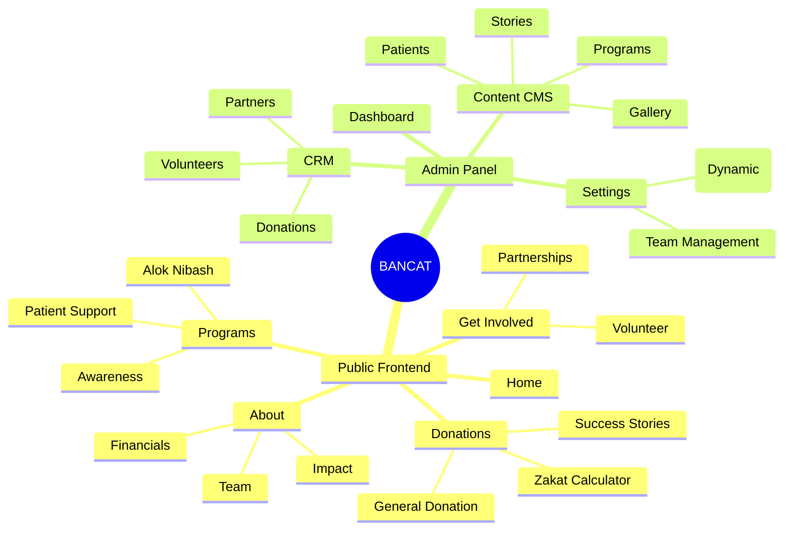
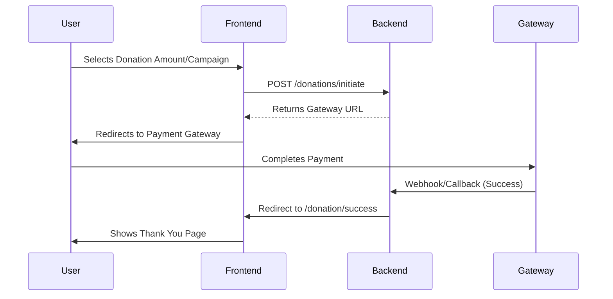
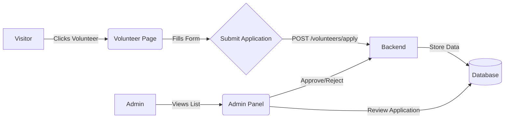

# Feature Analysis Report: BANCAT Platform

## 1. Executive Summary

The BANCAT platform is a comprehensive donation and support management system designed for cancer patient assistance. It connects donors, volunteers, and the organization through a public-facing portal and organizes operations via a dedicated Admin Panel. The system handles donations, Zakat calculations, volunteer recruitment, and patient impact storytelling.

## 2. Technical Architecture

The platform operates as a distributed web application:

- **Backend**: Laravel API (v1) serving data via REST endpoints.
- **Frontend**: React (Vite) application for public engagement.
- **Admin Panel**: Separate React (Vite) application for internal management.

```mermaid
graph TD
    User[Public User] --> Frontend[Frontend App (React)]
    Admin[Administrator] --> AdminPanel[Admin Panel (React)]
    Frontend --> API[Backend API (Laravel)]
    AdminPanel --> API
    API --> DB[(Database)]
```

## 3. Feature Inventory

### 3.1 Public Frontend Features

The public interface focuses on storytelling, trust-building, and ease of donation.

| Category | Features |
| :--- | :--- |
| **Donations** | • One-time & Monthly Donations<br>• Zakat Calculator<br>• Campaign-specific giving<br>• Payment Gateway Integration |
| **Content** | • **Stories**: Individual patient stories with funding goals<br>• **Programs**: Detailed initiatives (e.g., Alok Nibash, Maa Bachao)<br>• **Impact**: Metrics and success stories<br>• **Gallery**: Visual documentation of activities |
| **Engagement** | • **Volunteer**: Application form for volunteers<br>• **Partnerships**: Brand & CSR partnership inquiries<br>• **Contact**: General inquiry forms |
| **Information** | • About Us (Team, Mission)<br>• Cancer Info resources<br>• Financial Transparency (implied via Impact) |

### 3.2 Admin Panel Features

The admin interface provides full CRUD (Create, Read, Update, Delete) capabilities for all public artifacts.

| Category | Capabilities |
| :--- | :--- |
| **Dashboard** | • High-level statistics (Donations, Impact)<br>• Quick access to recent activities |
| **Content Management** | • **Patients**: Profiling patients, medical info, funding needs<br>• **Stories**: Writing and publishing patient stories<br>• **Programs**: Managing initiative details<br>• **Pages**: CMS for dynamic pages (Privacy, Terms)<br>• **Gallery**: Uploading and organizing images |
| **CRM & Ops** | • **Donations**: Tracking all incoming funds and statuses<br>• **Volunteers**: Reviewing and managing applications<br>• **Partners**: Tracking partnership requests |
| **Approvals** | • Review workflows for submitted content (Campaigns, Stories) |

## 4. Visual Analysis

### 4.1 Site Map Structure

A high-level view of the application navigation structure for both client and admin.



### 4.2 Key User Flows

#### Donation Journey

The critical path for a user to contribute funds.



#### Volunteer Application Flow

How new volunteers join the organization.



## 5. Observations

- **Separation of Concerns**: The clear split between `admin` and `frontend` apps ensures security and specialized UIs.
- **Dynamic Routing**: The presence of `DynamicPage` components suggests a flexible CMS capability allowing admins to create new content pages without code changes.
- **Rich Media**: Dedicated Gallery management indicates a strong focus on visual storytelling.
- **Zakat Focus**: Specialized Zakat calculator highlights the target demographic's specific needs.
